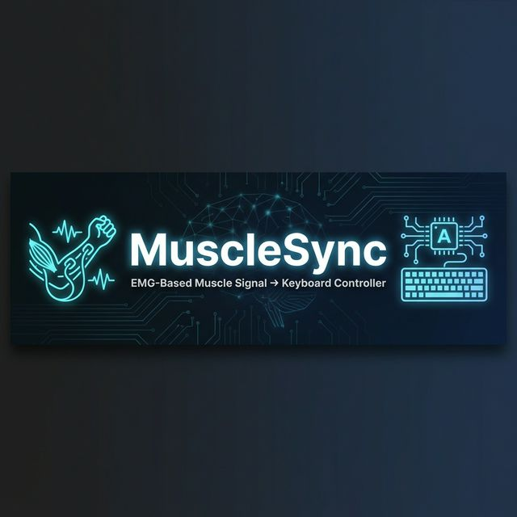

<h1 align="center">MuscleSync</h1>
<p align="center">
  <em>Real-time EMG Muscle Signal to Keyboard Controller via Arduino</em>
</p>

<p align="center">
  
  
  
  
</p>

---

## What is MuscleSync?

**MuscleSync** is an IoT project that captures **EMG (Electromyography) muscle electrical signals** through a surface electrode sensor, processes them on an **Arduino microcontroller**, and maps the classified gesture states to real-time **keyboard inputs** on a connected PC.

> **In short:** Flex your muscle — move a cursor or control software with no touch required.

### How It Works

```
[ Arm / Muscle ] --(EMG Electrode)--> [ Arduino + EMG Sensor ]
    |
[ Serial (UART @ 115200 baud) ]
    |
[ Python Script (mpmc.py) ]
    |
[ Keyboard Keypress Emulation via pynput ]
    |
[ PC / Game / Presentation ]
```

### Signal Classification — Gesture to Key Mapping

| Signal Value | Gesture State            | Keyboard Output |
|:---:|:---:|:---:|
| `3`          | Muscle Contracted — Left  | Left Arrow      |
| `2`          | Muscle Contracted — Right | Right Arrow     |
| `1`          | Rest / No Contraction     | Key Released    |

---

## Project Snapshots

<p align="center">
  
  &nbsp;&nbsp;
  
</p>
<p align="center">
  <sub>Left: Circuit overview &nbsp;|&nbsp; Right: Complete assembled project</sub>
</p>

---

## Project Structure

```
MuscleSync/
├── mpmc.py              # Main: reads serial data and emits keyboard events
├── import serial.py     # Alternate serial reader (COM12 variant)
├── det.py               # COM port auto-detection utility
├── excel data read.py   # Data logging / Excel export
├── test.py              # Testing and debugging script
├── test.c               # C implementation (bit stuffing utility)
├── workingmpmc/         # Stable working build snapshot
├── Mini project.png     # Hardware circuit photo
├── Mini project cmp.png # Complete project photo
└── README.md
```

---

## Tools & Technologies

| Category          | Technology                              |
|-------------------|-----------------------------------------|
| **Microcontroller** | Arduino (ATmega328P)                  |
| **Sensor**          | EMG / Muscle Signal Sensor Module     |
| **Communication**   | UART Serial @ 115200 baud             |
| **Language (PC)**   | Python 3.x                            |
| **Language (MCU)**  | Embedded C (Arduino)                  |
| **Key Libraries**   | `pyserial`, `pynput`                  |
| **Data Logging**    | `openpyxl` / CSV via Excel read script|
| **IDE / Tools**     | Arduino IDE, VS Code, Python IDLE     |
| **OS**              | Windows 10/11                         |

### Python Dependencies

```bash
pip install pyserial pynput openpyxl
```

---

## Getting Started

### 1. Flash the Arduino
Upload the EMG signal classification sketch to your Arduino via **Arduino IDE**.  
Ensure it transmits `1`, `2`, or `3` over Serial at **115200 baud** based on muscle gesture.

### 2. Detect Available COM Ports
```bash
python det.py
```
Select the correct COM port when prompted.

### 3. Run the Keyboard Controller
```bash
python mpmc.py
```
> Edit `mpmc.py` line 7 to match your Arduino's COM port:
> ```python
> ser = serial.Serial('COM7', 115200, timeout=1)
> ```

### 4. Flex and Control
Once running, muscle contractions will map to **left/right arrow keys** in real-time.

---

## License

This project is open-source under the [MIT License](LICENSE).
